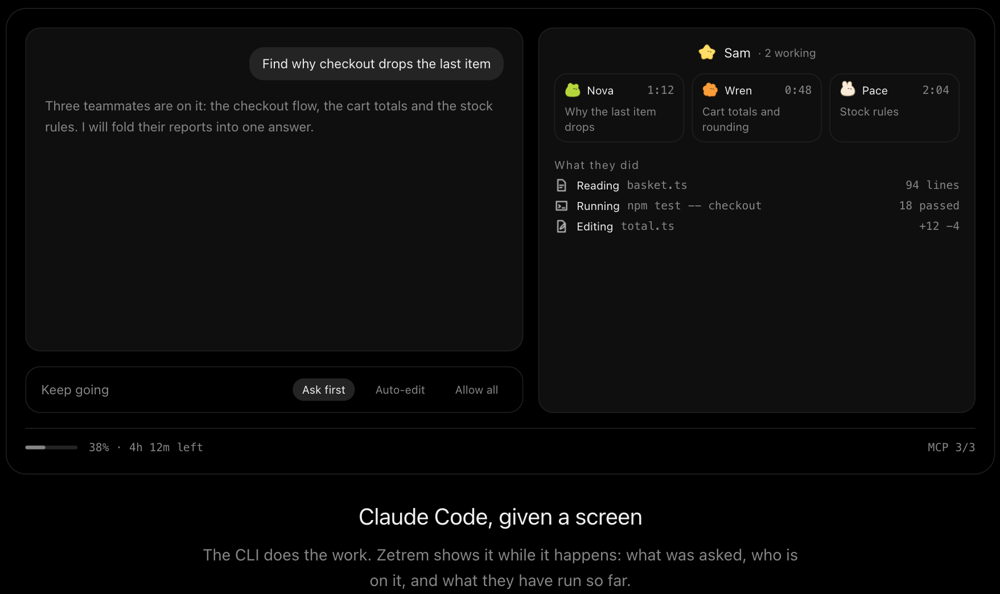
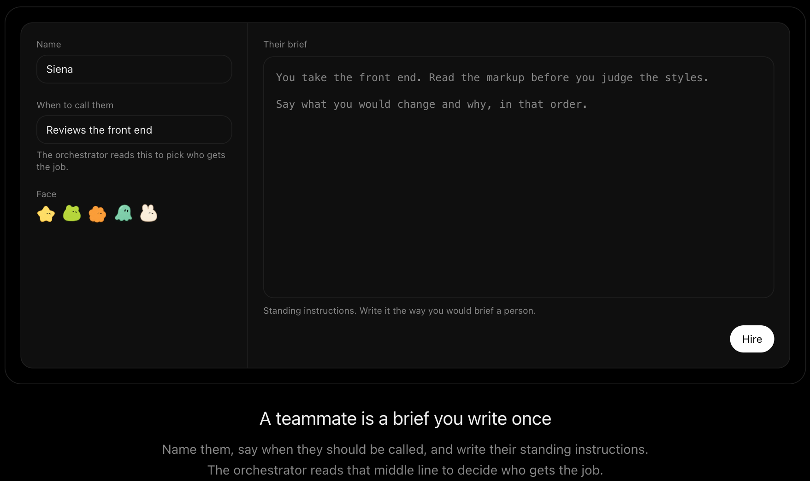

<div align="center">



<h1>Zetrem 1.0 beta</h1>

<p>A desktop app for running a team of Claude Code agents. Hand work to named
teammates, see what each of them is doing, and answer when one needs approval.
The Claude Code CLI does the work itself, unchanged.</p>

<p>
  <a href="https://github.com/rayforvideos/Zetrem/actions/workflows/ci.yml"></a>
  <a href="https://github.com/rayforvideos/Zetrem/releases"></a>
  <a href="LICENSE"></a>
  
</p>

<p align="center">
  <strong>
    <a href="#why-zetrem">Why Zetrem</a> ·
    <a href="#running-it">Running it</a> ·
    <a href="#how-zetrem-works">How it works</a> ·
    <a href="CONTRIBUTING.md">Contributing</a> ·
    <a href="README.ko.md">한국어</a>
  </strong>
</p>

</div>

---

> **Beta.** In daily use by its author and checked on both platforms at
> release time, but not yet tested widely.

---

## Table of Contents

- [Why Zetrem](#why-zetrem)
- [Running it](#running-it)
- [How Zetrem works](#how-zetrem-works)
- [Making a teammate](#making-a-teammate)
- [What it can do](#what-it-can-do)
- [Building](#building)
- [How it fits together](#how-it-fits-together)
- [Contributing](#contributing)
- [Data and network](#data-and-network)
- [Licence](#licence)

---

## Why Zetrem

Claude Code splits large jobs across subagents, but a terminal shows the result
as one stream. With three agents running, their output interleaves, tool calls
cut in, and a question waiting for approval can scroll past in the middle of it.

Zetrem lays that same information out on a screen:

- who is working on what
- what has finished so far
- whether anything is waiting for approval

It does not touch the answers. No persona and no style rules are passed to the
CLI; the one thing Zetrem adds is the project's library and how to use it, so
the same question gets the same reply it would get in a terminal, informed by
what the project already knows.

---

## Running it

You need Node 22.13 or newer. The [Claude Code](https://claude.com/claude-code)
CLI is found wherever its installers put it, and if it is missing the setup
screen offers to install it; signing in happens there too.

```bash
npm install
npm run dev
```

On first launch, pick an account and a project folder, choose how far agents may
go without asking, and start.

---

## How Zetrem works

When you hand over a job, this is what happens:

1. **Zetrem starts one Claude Code session** with your teammates and the
   project's library declared to it, and reads its `stream-json` output.
2. **The orchestrator decides who gets what.** It can read, edit and run things
   itself, or hand a piece to a teammate whose brief fits.
3. **Each teammate gets a tile** carrying their name, what they were asked, how
   long they have been at it, and every tool call they have made.
4. **It asks on screen when approval is needed.** Depending on the permission
   mode, editing a file or running a command waits for an answer.
5. **It gathers the reports into one reply.** Conversations are saved per
   project, so reopening one continues where it stopped.
6. **It notifies you** when work finishes or needs approval, but only while the
   window is behind another.

---

## Making a teammate

<div align="center">

</div>

A teammate is three things: a name, when to call them, and their standing
instructions. The orchestrator reads the middle one to decide who gets a job.
Teammates are stored per user rather than per project, so they are available in
any folder.

You can also restrict a teammate to certain tools, or attach documents for them
to read first. Both are passed to the session.

---

## What it can do

| | |
|---|---|
| **Library** | Notes each project keeps, under its own `.zetrem/library`. Agents search it before they say they do not know and file what they learn; "To library" under an answer files that answer. A switch in the composer decides, per project, whether sessions get it. |
| **Teammates** | Created in the app, stored per user. Callable from any project, each with its own model, tools and reading list. |
| **Built-in agents** | The agents Claude Code provides. Each can be switched off. |
| **Permission modes** | Ask first · Auto-edit (edits files, asks before commands) · Allow all. |
| **Model and effort** | Picked where you type, applied from the next session: the model, and Claude Code's effort level (low to max) under it. |
| **Connectors** | Add, sign into and remove MCP servers in the app. |
| **Plugins** | Browse and install marketplaces in the app. |
| **Usage** | Shows your account limits, including per-model limits where they exist. |
| **Languages** | English and Korean. [Adding one](docs/translating.md) means a PO file. |

---

## Building

```bash
npm run package:mac     # .app in release/
npm run package:win     # NSIS installer in release/
```

CI runs the checks on Linux on every push. The macOS and Windows matrix, which
includes launch, package, and a smoke test, runs for release tags and on
demand.

---

## How it fits together

```
electron/     main process. Spawns the CLI, owns the filesystem and IPC
src/app       composition root and the IPC contract
src/pages     screens
src/widgets   composed blocks
src/entities  domain concepts
src/shared    things with no domain knowledge
```

The renderer uses no Node APIs. Everything it needs goes through the IPC defined
in `src/app/api/desk.ts`, which checks that each request came from where it
should have.

Project conventions are enforced by tests in `tests/conventions/`: folder layout,
where type files go, no Korean in the UI outside the dictionary, no translation
macro in the main process, and a type on every commit message. `npm test` reports
which one a change broke.

---

## Contributing

Read [CONTRIBUTING.md](CONTRIBUTING.md), then open an issue or a pull request.
Translations into a new language are the easiest place to start:
[docs/translating.md](docs/translating.md).

Security issues go through [SECURITY.md](SECURITY.md), privately.

---

## Data and network

There is no analytics, no crash reporting and no account of ours. Zetrem makes
two requests of its own: to `registry.npmjs.org`, to check whether a newer
Claude Code has been published, and to GitHub Releases, to fetch its own
updates. All other traffic is the CLI you installed, using your account.

Conversations, teammates and settings are files in the app's data directory;
a removed conversation goes to a `trash/` folder there, never unlinked. A
project's library is Markdown files inside the project itself, under
`.zetrem/library`, so it travels with the folder. Each library is served to
sessions by a local MCP server on `127.0.0.1` with a per-launch token.
Signing in and out is handled by the CLI, so signing out here signs out every
Claude Code on the computer.

---

## Licence

[MIT](LICENSE). © 2026 Sangjun Park.

Zetrem does not ship Claude Code. It runs the CLI you installed, and those terms
are between Anthropic and you.
